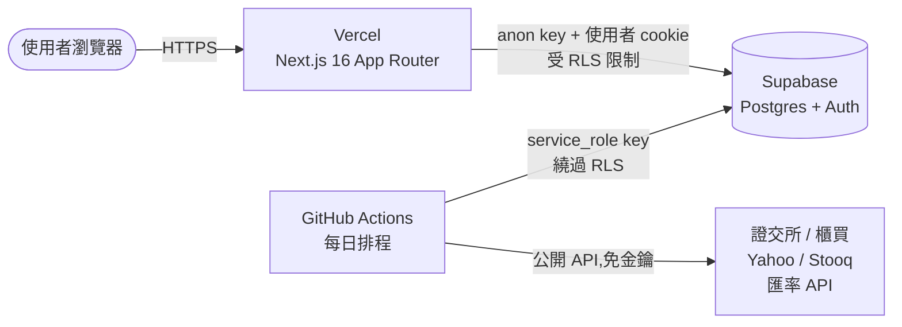
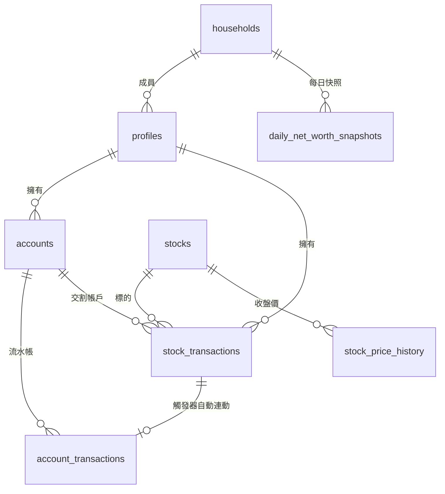
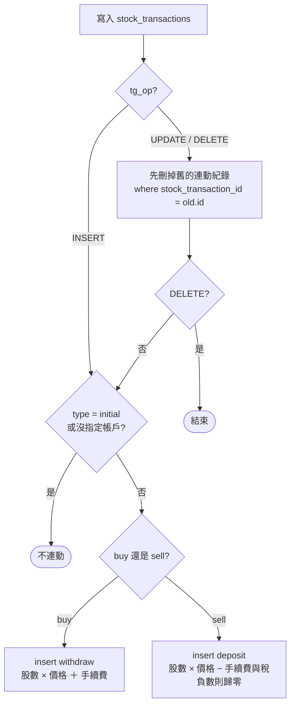
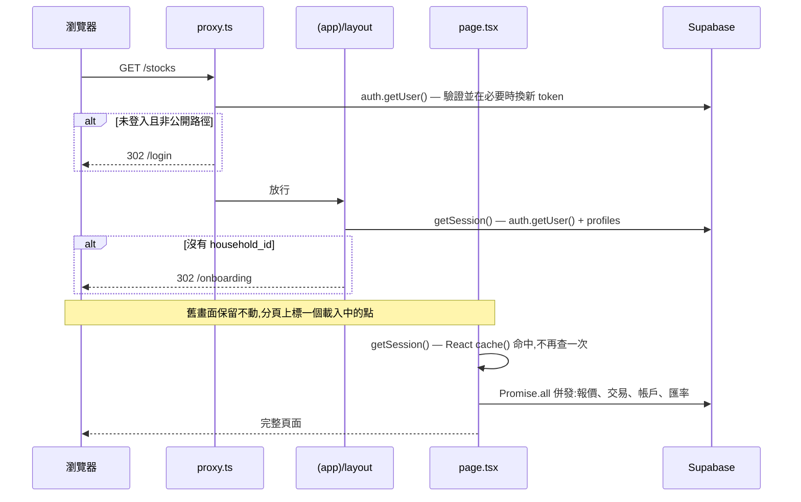
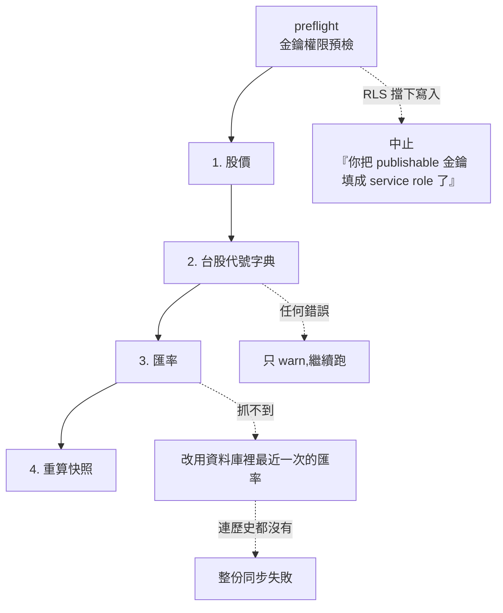

# 技術文件

這份講**系統怎麼運作**。另外兩份各有分工,遇到問題先看對地方:

| 文件 | 回答的問題 |
|---|---|
| [README](../README.md) | 怎麼把它架起來、部署、設定排程 |
| [CLAUDE.md](../CLAUDE.md) | 要改動時有哪些規則不能違反 |
| **這份** | 資料怎麼流、金額怎麼算出來、為什麼這樣設計 |
| [使用手冊](使用手冊.md) | 使用者怎麼操作 |

---

## 系統組成

三個服務,都在免費額度內,彼此只透過 Supabase 的資料庫溝通。



關鍵在兩條進入資料庫的路徑權限完全不同:

- **網站**用 anon key 加上使用者的登入 cookie,每一次查詢都被 RLS 過濾成「自己 + 同家庭」。
- **同步腳本**用 service_role key 繞過 RLS —— 它必須跨所有家庭成員讀寫才算得出全家快照。這把金鑰只存在 GitHub Secrets,絕不進前端也不進版控。

---

## 資料模型

10 張表、3 個 view、6 個函式、4 個觸發器。全部定義在 [`supabase/schema.sql`](../supabase/schema.sql),整份可重複執行。



`fx_rates` 與 `market_symbols` 不跟任何表關聯,是獨立的參考資料。

### 表的職責

| 表 | 內容 | 誰寫入 |
|---|---|---|
| `households` / `profiles` | 家庭與成員。`profiles` 由 `auth.users` 的觸發器自動建立 | 註冊流程 |
| `accounts` | 銀行與券商虛擬帳戶。**沒有餘額欄位** | 使用者 |
| `account_transactions` | 現金流水帳。`signed_amount` 是 generated column | 使用者 + 觸發器 |
| `stocks` | 這個家庭真的交易過的標的,被 `stock_transactions` 以外鍵參照 | Server Action 自動補 |
| `stock_transactions` | 期初持股 / 買進 / 賣出 | 使用者 |
| `stock_price_history` | 每日收盤價 | 同步腳本 |
| `fx_rates` | 美元兌台幣 | 同步腳本 |
| `market_symbols` | **全市場代號字典**,只服務自動完成。跟 `stocks` 是兩回事 | 同步腳本 |
| `daily_net_worth_snapshots` | 每日總資產快照,趨勢圖的資料來源 | 同步腳本 |

### View

三個都是 `security_invoker = on`,所以查 view 時仍然套用查詢者自己的 RLS。

| View | 做什麼 |
|---|---|
| `account_balances` | `accounts` left join 流水帳,`sum(signed_amount)` 得出餘額 |
| `latest_stock_prices` | 每檔股票取最新一天 (`distinct on (symbol)`) |
| `latest_fx_rates` | 每組幣別對取最新一天 |

---

## 金額的三層真實來源

這是整個系統最重要的一段。**三層各有唯一來源,任何地方都不該重算或加快取欄位。**

### 1. 帳戶餘額 = 資料庫算的

`accounts` 沒有餘額欄位,連快取都沒有。方向由 `type` 決定,存成 generated column:

```sql
signed_amount numeric(18,2) generated always as (
  case type
    when 'withdraw'     then -amount
    when 'transfer_out' then -amount
    else amount   -- initial / deposit / transfer_in / adjustment
  end
) stored
```

餘額就是 `account_balances` view 把它加總。**要改餘額只能新增一筆流水。**

這個設計的代價是每次查餘額都要 aggregate;好處是不可能出現「總額欄位跟流水帳對不起來」這種必須人工修的狀態 —— 對記帳系統而言後者是致命的。

一個帳戶只能有一筆 `initial`,由 partial unique index 保證:

```sql
create unique index uniq_acct_initial on public.account_transactions(account_id)
  where type = 'initial';
```

### 2. 券商現金 = 觸發器算的

`sync_broker_cash()` 掛在 `stock_transactions` 的 insert / update / delete 上:



UPDATE 時先刪再建,所以改一筆買賣不會留下兩筆連動紀錄。這些列帶有 `stock_transaction_id`,**永遠不要手動新增或修改**。

期初持股不連動 —— 它代表既有部位,不是新的資金進出。

### 3. 持股均價 = `lib/holdings.ts` 算的

移動加權平均法,網站與同步腳本共用同一份實作:

| 交易 | 均價 | 持股 |
|---|---|---|
| `initial` | 直接採用輸入值作為起點 | 設定為輸入股數 |
| `buy` | `(原持股 × 原均價 + 買進股數 × 買進價 + 手續費) ÷ 總股數` | 增加 |
| `sell` | **不變** | 減少,成本按均價等比移出,差額計入已實現損益 |

排序規則影響結果可重現性,不要改動:**交易日 → 同日 `initial` 優先 → `created_at` → `id`**。同日的期初持股必須排在買賣之前,否則買賣會算在錯的基準上。

賣超時以實際持股為上限,不會出現負股數;股數小於 `1e-9` 視為清空,均價歸零。

---

## 一次頁面請求

所有頁面都是 `force-dynamic`,沒有任何快取。



兩個為了速度而存在的機制:

- **`getSession()` 用 React `cache()` 包住。** layout 與頁面在同一個請求裡各呼叫一次;沒有這層會讓 `auth.getUser()` 與成員查詢整組跑兩次。作用範圍是單一請求,不跨請求或跨使用者。
- **函式跑在東京(`vercel.json` 釘 `hnd1`),跟 Supabase 同區。** 沒釘的話 Vercel 預設在美東,每一趟查詢都橫跨太平洋,而一次換頁有好幾趟接續的往返。

換頁時**刻意不用整頁骨架**(曾經每個路由都放 `loading.tsx`,但那會在伺服器回應前把畫面清空,看起來像什麼都沒有)。改成保留舊內容,由 `Nav` 的 `PendingDot`(`useLinkStatus`)在被點的分頁上標一個點。

`getSession()` 只查一次 `profiles`:RLS 是「自己 or 同家庭」,所以撈成員清單那次已經包含自己,不需要再單獨查一次。

---

## 權限模型

**RLS 是唯一的安全邊界,不是輔助措施。** 應用層沒有任何權限判斷可以被繞過。

| 範圍 | 規則 |
|---|---|
| 讀 | 同一家庭 —— `owner_id in (select household_member_ids())` |
| 寫 | 只有本人 —— `owner_id = auth.uid()` |
| 市場資料 | 所有登入者可讀;寫入由 service_role 繞過 RLS |

輔助函式 `current_household_id()` 與 `household_member_ids()` 是 `security definer`,因為 RLS 政策評估時需要查 `profiles`,而 `profiles` 自己也開著 RLS,不繞一層會遞迴。

schema 第 8 節逐一收回這些函式的 `PUBLIC` / `anon` EXECUTE 權限 —— Postgres 預設會把函式權限授予 PUBLIC,代表未登入者能透過 `/rest/v1/rpc/...` 直接呼叫。觸發器專用的兩個函式收到完全不可呼叫;RLS 輔助函式與前端 RPC 只留給 `authenticated`。

> Supabase 的安全掃描仍會對 `create_household`、`join_household`、`current_household_id`、`household_member_ids` 報 WARN(「登入者可執行 SECURITY DEFINER 函式」)。這四個是**刻意**開放給 `authenticated` 的,前端 RPC 與政策評估都需要,linter 不管意圖一律標記。

`/api/symbols` 也不另外檢查身分 —— 它用帶 cookie 的 client 查 `market_symbols`,而該表的政策只開放 `authenticated`,未登入的請求自然拿到空結果。

---

## 每日同步

[`scripts/sync-prices.ts`](../scripts/sync-prices.ts),由 GitHub Actions 每個工作日跑兩次(台灣時間 14:30 台股收盤後、隔天 06:30 美股收盤後補抓美股與匯率),也可手動觸發。`concurrency` 設定確保兩個排程不會同時寫入。



**preflight** 用 ISO 4217 保留給測試的貨幣代碼 `XTS` 對 `fx_rates` 寫一筆再刪掉,確認金鑰真的能繞過 RLS。這是為了避免抓完一整輪報價才在寫入時失敗,而且 Postgres 只會回一句看不懂的 `violates row-level security policy` —— 最常見的原因其實是 `SUPABASE_SERVICE_ROLE_KEY` 被填成了 publishable 金鑰。`explainWriteError()` 把這個情況翻譯成可行動的訊息。

**代號字典**整段包在 `try` 裡,壞掉只 warn。它是自動完成的便利資料,不該讓價格與快照跟著失敗。同樣的理由,`fetchTwSymbols()` 刻意跟收盤價分開再打一次同樣的端點,不共用回應。

**快照**先刪掉那些日期的列再重寫,所以重跑不會產生重複。每位成員一列,另外每個家庭多一列 `owner_id IS NULL` 的合計 —— 首頁「全家」視角讀的就是那一列。

### 歷史回填

每日同步只寫「今天」那一列,**永遠不會回頭修正過去的日期**。所以補登一筆日期在過去的交易(最典型的是期初持股填了幾個月前的持有起始日)之後,那天到今天之間的快照會一直停留在舊值,趨勢圖上留下一道永久的斷崖。

[`scripts/backfill.ts`](../scripts/backfill.ts) 解決這件事:從最早一筆交易重算到今天。刻意不排程,由 GitHub Actions 的「回填歷史資產快照」手動觸發,或本機 `npm run backfill`。

| 資料 | 來源 | 一次請求 |
|---|---|---|
| 台股歷史 | 證交所 `STOCK_DAY` → 落空才試櫃買 | **一檔一個月** |
| 美股歷史 | Yahoo `period1`/`period2` | 一檔全區間 |
| 歷史匯率 | Yahoo `TWD=X` | 一次全區間 |

台股是最大的成本,而且證交所對連續請求會擋,所以月檔之間隔 1.2 秒。抓到的收盤價會一併寫進 `stock_price_history`,重跑第二次幾乎不用再連外網。

非交易日(週末、假日)沿用最近一次收盤價 —— 那正是那幾天的實際市值。第一個收盤日之前不給價,不往回猜。

**計算本身在 `lib/snapshots.ts` 的 `computeSnapshotRows()`,每日同步與回填共用這一份。** 它自己依日期過濾交易,所以回填撈一次資料就能算出整段期間的每一天。

回溯期間的**市值是準的,但未實現損益只能當參考** —— 期初持股只記「當下的均價」,不記你當初怎麼買的,所以成本基礎跟真實歷史不同。

### 資料來源與備援

| 資料 | 主來源 | 備援 |
|---|---|---|
| 台股上市 | 證交所 `STOCK_DAY_ALL` | 無(一次呼叫涵蓋全市場) |
| 台股上櫃 | 櫃買中心 OpenAPI | 無 |
| 美股 | Yahoo Finance | Stooq CSV |
| 匯率 | open.er-api.com | Frankfurter |

全部免金鑰。台股一次呼叫拿回全市場,美股逐檔抓(間隔 250ms)。單一標的抓不到只會 warn,不中斷整份同步。

證交所與櫃買的回應也含權證,數量是一般股票的五倍。`isWarrant()` 用代號形狀濾掉(七開頭六碼,認購全數字、認售 `U` 結尾)—— **不能用名稱濾**,因為 `2945 三商家購`、`3085 新零售` 這種正常股票的名字裡就有「購」「售」。

---

## 幣別與刻意的降級規則

換算成台幣只在兩個地方發生:網站是 `lib/portfolio.ts` 的 `toTwd()`,腳本是 `rebuildSnapshots()` 內。其餘所有計算都留在原幣別 —— 台股與美股的損益直接相加會得出無意義的數字。

兩條看起來像 bug 但其實是刻意的規則,**改動前請先理解**:

| 情況 | 行為 | 為什麼 |
|---|---|---|
| 缺報價 | 退回成本價估市值(`?? h.avgCost`),畫面標「未同步」 | 總資產不該因為少一天報價就憑空掉一塊 |
| 缺匯率 | 先用資料庫最近一次的;連歷史都沒有就**讓整份同步失敗** | 寧可少一天資料,也不要用 1:1 硬算,在趨勢圖留下假的斷崖 |

首頁主數字是即時算的,趨勢圖卻是每日快照。排程還沒跑到今天之前兩者會對不起來,所以首頁會在曲線末端補上一個「今天」的即時點,讓它收在跟主數字相同的位置。

---

## 測試涵蓋範圍

`npm test`,50 個測試,全部不連網(`globalThis.fetch` 被換成假的),但需要先 `npm install`。

| 檔案 | 數量 | 涵蓋 |
|---|---|---|
| `holdings.test.ts` | 14 | 均價計算的各種情境:買賣交錯、同日排序、賣超、零股、多人多檔、全家合併 |
| `providers-parsing.test.ts` | 8 | 各來源的真實回應格式解析、代號字典的權證過濾、來源失敗時的備援 |
| `symbol-search.test.ts` | 7 | 自動完成的排序與查詢字串清理 |
| `sync-errors.test.ts` | 5 | 金鑰拿錯時的錯誤判讀 |
| `snapshots.test.ts` | 12 | 每日快照:依日期取捨交易、當天收盤價估值、缺價退回成本、美元換算、家庭合計、週末沿用價格 |
| `providers.test.ts` | 4 | 民國日期轉西元 |

### 沒有涵蓋的部分

誠實列出來,不要以為跑過 `npm test` 就等於驗證完畢:

- **沒有任何 E2E 或元件測試。** 頁面、表單、圖表都只過型別檢查。
- **`/api/symbols` 的資料庫查詢沒有測試。** 排序邏輯抽到 `lib/symbol-search.ts` 有測,但那句 PostgREST 的 `.or()` + `ilike` 只能在真實環境驗證。
- **RLS 政策沒有自動化測試。**
- **`supabase/test_schema.sql` 不是自動斷言。** 它是 psql 腳本,用 `\echo` 加 `select` 把結果印出來給人目視比對(每個檢查的註解寫了預期值),涵蓋觸發器連動、餘額計算、`initial` 唯一性與負數約束共 10 項。需要本機 PostgreSQL,而且開頭的 `ON_ERROR_STOP on` 跟第 9、10 項「預期會噴錯」的檢查互動如何,值得實際跑一次確認。

---

## 已知限制

- **美股沒有自動完成。** 沒有乾淨的免費「全清單」來源,`market_symbols` 目前只有台股。
- **`sanitizeQuery()` 會濾掉小數點**,所以 `BRK.B` 這類美股代號會被清成 `BRKB`。台股不受影響,但補上美股支援時要先處理。
- **repo 不能放在 Google Drive 同步的資料夾裡。** npm 解壓大量小檔會跟 Drive 打架,`npm ci` 穩定噴 `EBADF`。
- **`npm run lint` 跑不起來** —— script 在 `package.json` 裡,但沒有 eslint 設定檔也沒裝 eslint。型別檢查用 `npm run build` 或 `tsc --noEmit`。
- **repo 連續 60 天沒有 commit,GitHub 會自動停用排程**,屆時要到 Actions 分頁重新啟用。
