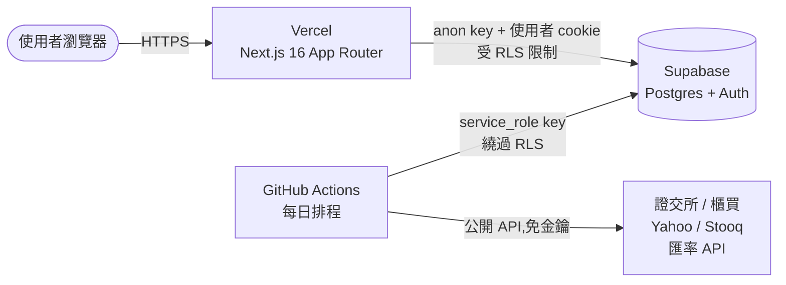
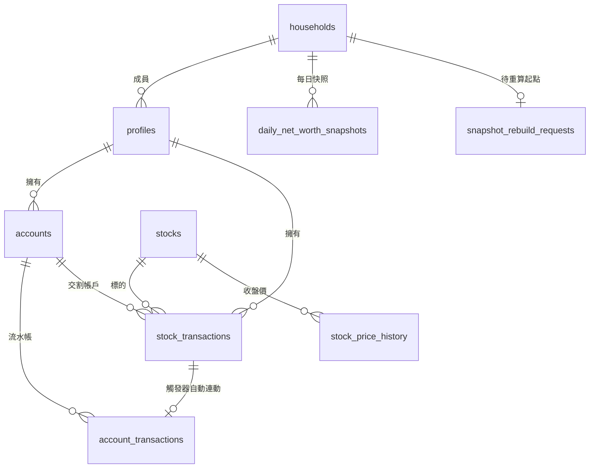
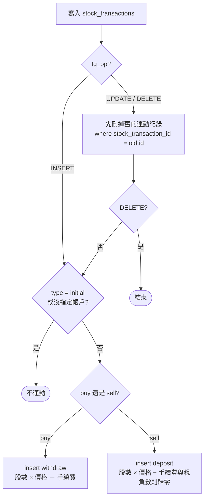
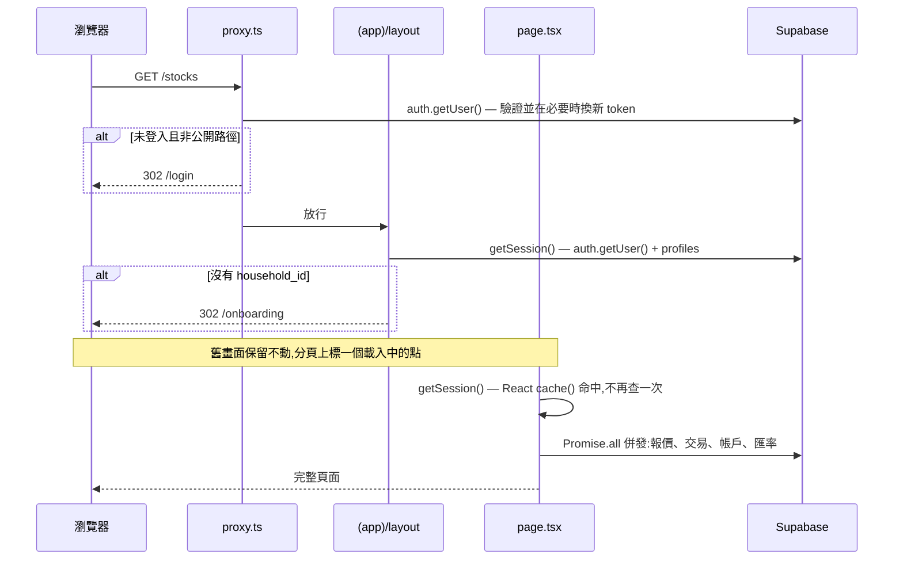
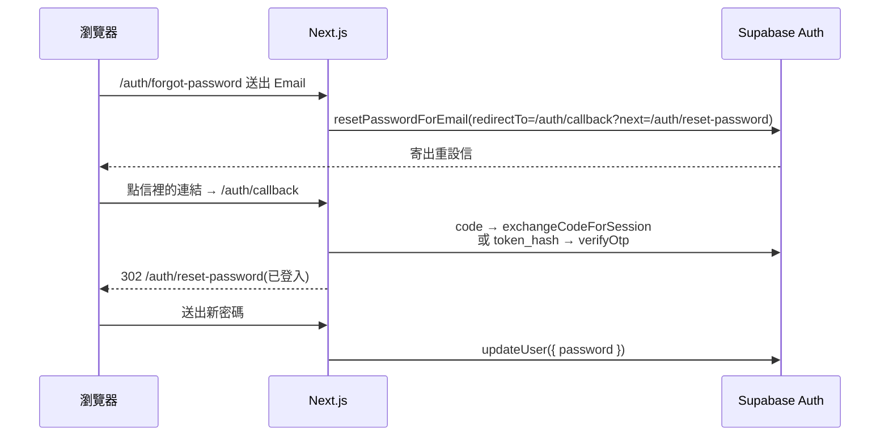
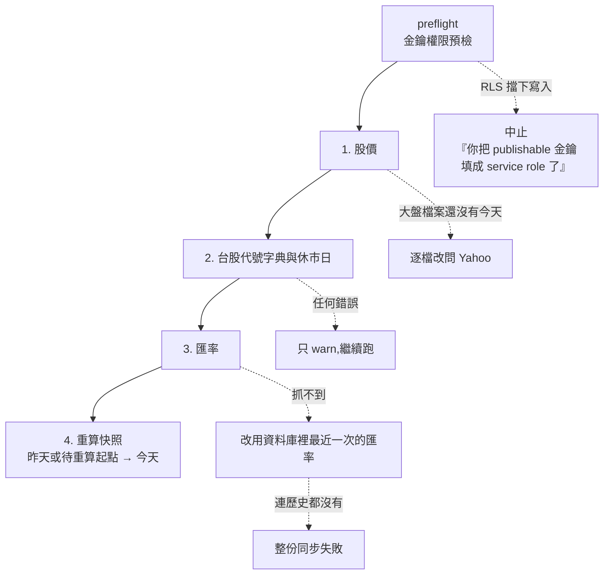

# 技術文件

這份講**系統怎麼運作**。另外兩份各有分工,遇到問題先看對地方:

| 文件 | 回答的問題 |
|---|---|
| [README](../README.md) | 怎麼把它架起來、部署、設定排程 |
| [CLAUDE.md](../CLAUDE.md) | 要改動時有哪些規則不能違反 |
| **這份** | 資料怎麼流、為什麼這樣設計 |
| [數字怎麼算](數字怎麼算.md) | 每一個金額的公式與演算 |
| [使用手冊](使用手冊.md) | 使用者怎麼操作 |

---

## 系統組成

三個服務,都在免費額度內,彼此只透過 Supabase 的資料庫溝通。


```mermaid
flowchart LR
  U([使用者瀏覽器])
  V["Vercel<br/>Next.js 16 App Router"]
  S[("Supabase<br/>Postgres + Auth")]
  G["GitHub Actions<br/>每日排程"]
  E["證交所 / 櫃買<br/>Yahoo / Stooq<br/>匯率 API"]

  U -->|"HTTPS"| V
  V -->|"anon key + 使用者 cookie<br/>受 RLS 限制"| S
  G -->|"service_role key<br/>繞過 RLS"| S
  G -->|"公開 API,免金鑰"| E
```

關鍵在兩條進入資料庫的路徑權限完全不同:

- **網站**用 anon key 加上使用者的登入 cookie,每一次查詢都被 RLS 過濾成「自己 + 同家庭」。
- **同步腳本**用 service_role key 繞過 RLS —— 它必須跨所有家庭成員讀寫才算得出全家快照。這把金鑰只存在 GitHub Secrets,絕不進前端也不進版控。

---

## 資料模型

12 張表、3 個 view、7 個函式、6 個觸發器。全部定義在 [`supabase/schema.sql`](../supabase/schema.sql),整份可重複執行。


```mermaid
erDiagram
  households ||--o{ profiles : "成員"
  profiles ||--o{ accounts : "擁有"
  profiles ||--o{ stock_transactions : "擁有"
  accounts ||--o{ account_transactions : "流水帳"
  accounts ||--o{ stock_transactions : "交割帳戶"
  stocks ||--o{ stock_transactions : "標的"
  stocks ||--o{ stock_price_history : "收盤價"
  households ||--o{ daily_net_worth_snapshots : "每日快照"
  households ||--o| snapshot_rebuild_requests : "待重算起點"
  stock_transactions ||--o| account_transactions : "觸發器自動連動"
```

`fx_rates`、`market_symbols`、`market_holidays` 不跟任何表關聯,是獨立的參考資料。

### 表的職責

| 表 | 內容 | 誰寫入 |
|---|---|---|
| `households` / `profiles` | 家庭與成員。`profiles` 由 `auth.users` 的觸發器自動建立 | 註冊流程 |
| `accounts` | 銀行與券商虛擬帳戶。**沒有餘額欄位** | 使用者 |
| `account_transactions` | 現金流水帳。`signed_amount` 是 generated column | 使用者 + 觸發器 |
| `stocks` | 這個家庭真的交易過的標的,被 `stock_transactions` 以外鍵參照 | Server Action 自動補 |
| `stock_transactions` | 期初持股 / 買進 / 賣出 | 使用者 |
| `stock_price_history` | 每日收盤價 | 同步腳本 |
| `fx_rates` | 美元兌台幣 | 同步腳本 |
| `market_symbols` | **全市場代號字典**,只服務自動完成。跟 `stocks` 是兩回事 | 同步腳本 |
| `market_holidays` | 證交所年度行事曆裡**沒有交易**的日子,日曆標節日名稱用 | 同步腳本 |
| `daily_net_worth_snapshots` | 每日總資產快照,趨勢圖與日曆的資料來源 | 同步腳本 |
| `snapshot_rebuild_requests` | 每個家庭「快照要從哪天開始重算」,一家一列、只留最早的日期。**沒有任何 policy**,使用者讀寫不到 | 觸發器寫、同步腳本清 |

### View

三個都是 `security_invoker = on`,所以查 view 時仍然套用查詢者自己的 RLS。

| View | 做什麼 |
|---|---|
| `account_balances` | `accounts` left join 流水帳,`sum(signed_amount)` 得出餘額 |
| `latest_stock_prices` | 每檔股票取最新一天 (`distinct on (symbol)`) |
| `latest_fx_rates` | 每組幣別對取最新一天 |

---

## 金額的真實來源

這是整個系統最重要的一段。**每一層各有唯一來源,任何地方都不該重算或加快取欄位。**

> 這裡講的是架構上的分層。每一條公式的細節與實際數字演算在 **[數字怎麼算](數字怎麼算.md)**。

### 1. 帳戶餘額 = 資料庫算的

`accounts` 沒有餘額欄位,連快取都沒有。方向由 `type` 決定,存成 generated column:

```sql
signed_amount numeric(18,2) generated always as (
  case type
    when 'withdraw'     then -amount
    when 'transfer_out' then -amount
    else amount   -- initial / deposit / transfer_in / adjustment
  end
) stored
```

餘額就是 `account_balances` view 把它加總。**要改餘額只能新增一筆流水。**

這個設計的代價是每次查餘額都要 aggregate;好處是不可能出現「總額欄位跟流水帳對不起來」這種必須人工修的狀態 —— 對記帳系統而言後者是致命的。

一個帳戶只能有一筆 `initial`,由 partial unique index 保證:

```sql
create unique index uniq_acct_initial on public.account_transactions(account_id)
  where type = 'initial';
```

### 2. 券商現金 = 觸發器算的

`sync_broker_cash()` 掛在 `stock_transactions` 的 insert / update / delete 上:


```mermaid
flowchart TD
  A["寫入 stock_transactions"] --> B{"tg_op?"}
  B -->|UPDATE / DELETE| C["先刪掉舊的連動紀錄<br/>where stock_transaction_id = old.id"]
  B -->|INSERT| D
  C --> E{"DELETE?"}
  E -->|是| F(["結束"])
  E -->|否| D{"type = initial<br/>或沒指定帳戶?"}
  D -->|是| G(["不連動"])
  D -->|否| H{"buy 還是 sell?"}
  H -->|buy| I["insert withdraw<br/>股數 × 價格 ＋ 手續費"]
  H -->|sell| J["insert deposit<br/>股數 × 價格 − 手續費與稅<br/>負數則歸零"]
```

UPDATE 時先刪再建,所以改一筆買賣不會留下兩筆連動紀錄。這些列帶有 `stock_transaction_id`,**永遠不要手動新增或修改**。

期初持股不連動 —— 它代表既有部位,不是新的資金進出。

### 3. 持股均價 = `lib/holdings.ts` 算的

移動加權平均法,網站與同步腳本共用同一份實作:

| 交易 | 均價 | 持股 |
|---|---|---|
| `initial` | 直接採用輸入值作為起點 | 設定為輸入股數 |
| `buy` | `(原持股 × 原均價 + 買進股數 × 買進價 + 手續費) ÷ 總股數` | 增加 |
| `sell` | **不變** | 減少,成本按均價等比移出,差額計入已實現損益 |

排序規則影響結果可重現性,不要改動:**交易日 → 同日 `initial` 優先 → `created_at` → `id`**。同日的期初持股必須排在買賣之前,否則買賣會算在錯的基準上。

賣超時以實際持股為上限,不會出現負股數;股數小於 `1e-9` 視為清空,均價歸零。

**已實現損益的合計要用 `lib/portfolio.ts` 的 `computeRealizedTwd()` 從全部交易重算。** `buildValuedHoldings()` 會濾掉股數 0 的標的,而全部賣光的那一檔正是已實現損益的來源 —— 從持股清單加總會讓它整筆消失(首頁曾經因此永遠顯示 0)。

### 4. 每日盈虧 = `lib/pnl.ts` 算的

`當日盈虧 = 今日股票市值 − 昨日股票市值 − 部位變動`。股票市值來自快照,部位變動直接讀當天的交易。**基準刻意是股票市值而不是總資產** —— 沒勾連動的買賣會讓總資產憑空增減。月合計(`monthTotal()`)與 12 個月列(`summarizeMonths()`)都是格子的加總,所以一定對得上。

休市判斷優先採用 `market_holidays`;行事曆沒列到的(颱風假)才退回「那天在已知報價範圍內卻沒有收盤價」的推斷。

### 5. 年度損益 = `lib/yearly.ts` 算的

每年結算「期末股票市值 − 期初 − 買入(含期初持股與手續費)+ 賣出實收」,扣掉當年已實現就是當年未實現。未實現是**當年變動**而不是年底帳面,所以各年可以直接相加。美股的已實現先在原幣別相減再換匯,舊年度不會被匯率重新計價。首頁「今年未實現 / 今年已實現」兩格讀的是這裡。

年度表只需要每個年底附近的價格,`getMarketDataNear()` 只撈每個年底往前 30 天,不撈整段歷史。

---

## 一次頁面請求

所有頁面都是 `force-dynamic`,沒有任何快取。


```mermaid
sequenceDiagram
  participant B as 瀏覽器
  participant P as proxy.ts
  participant L as (app)/layout
  participant G as page.tsx
  participant S as Supabase

  B->>P: GET /stocks
  P->>S: auth.getUser() — 驗證並在必要時換新 token
  alt 未登入且非公開路徑
    P-->>B: 302 /login
  end
  P->>L: 放行
  L->>S: getSession() — auth.getUser() + profiles
  alt 沒有 household_id
    L-->>B: 302 /onboarding
  end
  Note over B,G: 舊畫面保留不動,分頁上標一個載入中的點
  G->>G: getSession() — React cache() 命中,不再查一次
  G->>S: Promise.all 併發:報價、交易、帳戶、匯率
  G-->>B: 完整頁面
```

兩個為了速度而存在的機制:

- **`getSession()` 用 React `cache()` 包住。** layout 與頁面在同一個請求裡各呼叫一次;沒有這層會讓 `auth.getUser()` 與成員查詢整組跑兩次。作用範圍是單一請求,不跨請求或跨使用者。
- **函式跑在東京(`vercel.json` 釘 `hnd1`),跟 Supabase 同區。** 沒釘的話 Vercel 預設在美東,每一趟查詢都橫跨太平洋,而一次換頁有好幾趟接續的往返。

換頁時**刻意不用整頁骨架**(曾經每個路由都放 `loading.tsx`,但那會在伺服器回應前把畫面清空,看起來像什麼都沒有)。改成保留舊內容,由 `Nav` 的 `PendingDot`(`useLinkStatus`)在被點的分頁上標一個點。

`getSession()` 只查一次 `profiles`:RLS 是「自己 or 同家庭」,所以撈成員清單那次已經包含自己,不需要再單獨查一次。

**PostgREST 單次最多回 1,000 列,超過的部分會被無聲截掉,不會報錯。** 可能變長的查詢都要處理:
日曆一次撈整年,`getTradingDays()` 按月切段併發(5 檔 × 250 天就超過上限);同步腳本重算長區間時用 `scripts/db.ts` 的 `selectAll()` 分頁。

### 寫入與編輯

所有寫入走 `app/actions/`。股票交易的新增與編輯共用 `parseStockForm()`;**連動全部在資料庫層**,應用程式只改那一列:

| 編輯一筆股票交易後 | 誰負責 | 何時生效 |
|---|---|---|
| 持股、均價、已實現、年度表 | 每次從交易重算 | 立刻 |
| 券商帳戶餘額 | `sync_broker_cash()` 刪舊建新 | 立刻 |
| 趨勢圖、日曆格子 | `request_snapshot_rebuild()` 排入重算 | 下一次每日同步 |

刪除一律用 `components/ConfirmDelete.tsx` 的兩段式確認(不用 `window.confirm()`,部分 App 內建瀏覽器會擋)。

### 登入與重設密碼

`/login` 與 `/auth/*` 是 `lib/supabase/session.ts` 裡的公開路徑。


```mermaid
sequenceDiagram
  participant B as 瀏覽器
  participant A as Next.js
  participant S as Supabase Auth

  B->>A: /auth/forgot-password 送出 Email
  A->>S: resetPasswordForEmail(redirectTo=/auth/callback?next=/auth/reset-password)
  S-->>B: 寄出重設信
  B->>A: 點信裡的連結 → /auth/callback
  A->>S: code → exchangeCodeForSession<br/>或 token_hash → verifyOtp
  A-->>B: 302 /auth/reset-password(已登入)
  B->>A: 送出新密碼
  A->>S: updateUser({ password })
```

- 不管 Email 有沒有註冊過都回同一句話,避免被拿來試探帳號。
- `callback` 的 `next` 只接受站內路徑(`/` 開頭、不是 `//`),不能當成跳轉到外部網站的跳板。
- 預設信件範本的 `?code=` 是 PKCE,驗證碼的另一半存在申請那個瀏覽器的 cookie,換個瀏覽器打開就會失敗。README 建議把範本改成 `token_hash` 格式,任何瀏覽器都能開。

---

## 權限模型

**RLS 是唯一的安全邊界,不是輔助措施。** 應用層沒有任何權限判斷可以被繞過。

| 範圍 | 規則 |
|---|---|
| 讀 | 同一家庭 —— `owner_id in (select household_member_ids())` |
| 寫 | 只有本人 —— `owner_id = auth.uid()` |
| 市場資料 | 所有登入者可讀;寫入由 service_role 繞過 RLS |

輔助函式 `current_household_id()` 與 `household_member_ids()` 是 `security definer`,因為 RLS 政策評估時需要查 `profiles`,而 `profiles` 自己也開著 RLS,不繞一層會遞迴。

schema 第 8 節逐一收回這些函式的 `PUBLIC` / `anon` EXECUTE 權限 —— Postgres 預設會把函式權限授予 PUBLIC,代表未登入者能透過 `/rest/v1/rpc/...` 直接呼叫。觸發器專用的三個函式(`handle_new_user`、`sync_broker_cash`、`request_snapshot_rebuild`)收到完全不可呼叫;RLS 輔助函式與前端 RPC 只留給 `authenticated`。

`snapshot_rebuild_requests` 開著 RLS 但**沒有任何 policy**,等於使用者完全讀寫不到;只有 `security definer` 的觸發器與繞過 RLS 的同步腳本碰得到。

> Supabase 的安全掃描仍會對 `create_household`、`join_household`、`current_household_id`、`household_member_ids` 報 WARN(「登入者可執行 SECURITY DEFINER 函式」)。這四個是**刻意**開放給 `authenticated` 的,前端 RPC 與政策評估都需要,linter 不管意圖一律標記。

`/api/symbols` 也不另外檢查身分 —— 它用帶 cookie 的 client 查 `market_symbols`,而該表的政策只開放 `authenticated`,未登入的請求自然拿到空結果。

---

## 每日同步

[`scripts/sync-prices.ts`](../scripts/sync-prices.ts),由 GitHub Actions 每個工作日跑兩次(台灣時間 14:30 台股收盤後、隔天 06:30 美股收盤後補抓美股與匯率),也可手動觸發。`concurrency` 設定確保兩個排程不會同時寫入。


```mermaid
flowchart TD
  P["preflight<br/>金鑰權限預檢"] --> S1["1. 股價"]
  S1 --> S2["2. 台股代號字典與休市日"]
  S2 --> S3["3. 匯率"]
  S3 --> S4["4. 重算快照<br/>昨天或待重算起點 → 今天"]

  P -.->|"RLS 擋下寫入"| PE["中止<br/>『你把 publishable 金鑰<br/>填成 service role 了』"]
  S1 -.->|"大盤檔案還沒有今天"| Y["逐檔改問 Yahoo"]
  S2 -.->|"任何錯誤"| SW["只 warn,繼續跑"]
  S3 -.->|"抓不到"| F1["改用資料庫裡最近一次的匯率"]
  F1 -.->|"連歷史都沒有"| FE["整份同步失敗"]
```

**preflight** 用 ISO 4217 保留給測試的貨幣代碼 `XTS` 對 `fx_rates` 寫一筆再刪掉,確認金鑰真的能繞過 RLS。這是為了避免抓完一整輪報價才在寫入時失敗,而且 Postgres 只會回一句看不懂的 `violates row-level security policy` —— 最常見的原因其實是 `SUPABASE_SERVICE_ROLE_KEY` 被填成了 publishable 金鑰。`explainWriteError()` 把這個情況翻譯成可行動的訊息。

**台股收盤價**先抓證交所與櫃買的全市場檔案;證交所常常在 14:30 那班排程之後才更新,所以持股裡日期還停在前一天的標的,會逐檔改問 Yahoo(`.TW` 落空再試 `.TWO`)。同一檔同一天兩邊都有時以 `symbol|price_date` 去重,否則 upsert 會撞上 Postgres 的 `ON CONFLICT DO UPDATE cannot affect row a second time`。

**代號字典與休市日**各自包在 `try` 裡,壞掉只 warn。它們是自動完成與日曆標示的便利資料,不該讓價格與快照跟著失敗。同樣的理由,`fetchTwSymbols()` 刻意跟收盤價分開再打一次同樣的端點,不共用回應。休市日來自證交所 `holidaySchedule`,名稱以「交易日」結尾的(開始交易日、最後交易日)那天有開盤,要濾掉。

**快照**先刪掉那些日期的列再重寫,所以重跑不會產生重複。每位成員一列,另外每個家庭多一列 `owner_id IS NULL` 的合計 —— 首頁「全家」視角讀的就是那一列。重算範圍是「昨天」與「`snapshot_rebuild_requests` 最早的日期」兩者較早的那天到今天;算完只清掉**開跑之前**提出的請求,同步中途又有人改交易的話留給下一次。

### 排程保活

公開 repo 連續 60 天沒有活動,GitHub 會自動停用排程,而且不會通知。`.github/workflows/keepalive.yml` 每月 1 日對 `sync-prices.yml` 與自己呼叫一次「啟用」API(`PUT /actions/workflows/{id}/enable`),把計時歸零,不產生 commit。

### 歷史回填

每日同步平常只重算今天與昨天。補登、編輯、刪除過去的交易時,`request_snapshot_rebuild()` 觸發器會把最早受影響的日期記進 `snapshot_rebuild_requests`,下一次每日同步就從那天重算 —— 這已經涵蓋大部分「過去的快照要修正」的情況。

[`scripts/backfill.ts`](../scripts/backfill.ts) 從最早一筆交易重算到今天,並**補抓缺少的歷史收盤價**。每日同步只抓最新價,所以新增一檔以前沒有的股票、而交易日期在過去時,還是要跑這支。刻意不排程,由 GitHub Actions 的「回填歷史資產快照」手動觸發,或本機 `npm run backfill`。

| 資料 | 來源 | 一次請求 |
|---|---|---|
| 台股歷史 | 證交所 `STOCK_DAY` → 落空才試櫃買 | **一檔一個月** |
| 美股歷史 | Yahoo `period1`/`period2` | 一檔全區間 |
| 歷史匯率 | Yahoo `TWD=X` | 一次全區間 |

台股是最大的成本,而且證交所大約每 5 秒只接受 3 次請求,所以月檔之間隔 2 秒。抓到的收盤價會一併寫進 `stock_price_history`,重跑第二次幾乎不用再連外網。

非交易日(週末、假日)沿用最近一次收盤價 —— 那正是那幾天的實際市值。第一個收盤日之前不給價,不往回猜。

**計算本身在 `lib/snapshots.ts` 的 `computeSnapshotRows()`,每日同步與回填共用這一份。** 它自己依日期過濾交易,所以回填撈一次資料就能算出整段期間的每一天。

回溯期間的**市值是準的,但未實現損益只能當參考** —— 期初持股只記「當下的均價」,不記你當初怎麼買的,所以成本基礎跟真實歷史不同。

### 資料來源與備援

| 資料 | 主來源 | 備援 |
|---|---|---|
| 台股上市 | 證交所 `STOCK_DAY_ALL` | 持股逐檔問 Yahoo(`.TW` → `.TWO`) |
| 台股上櫃 | 櫃買中心 OpenAPI | 同上 |
| 台股休市日 | 證交所 `holidaySchedule` | 無(抓不到就沿用資料庫既有的) |
| 美股 | Yahoo Finance | Stooq CSV |
| 匯率 | open.er-api.com | Frankfurter |

全部免金鑰。台股一次呼叫拿回全市場,美股逐檔抓(間隔 250ms)。單一標的抓不到只會 warn,不中斷整份同步。

證交所與櫃買的回應也含權證,數量是一般股票的五倍。`isWarrant()` 用代號形狀濾掉(七開頭六碼,認購全數字、認售 `U` 結尾)—— **不能用名稱濾**,因為 `2945 三商家購`、`3085 新零售` 這種正常股票的名字裡就有「購」「售」。

---

## 幣別與刻意的降級規則

換算成台幣只在兩個地方發生:網站是 `lib/portfolio.ts` 的 `toTwd()`,腳本是 `rebuildSnapshots()` 內。其餘所有計算都留在原幣別 —— 台股與美股的損益直接相加會得出無意義的數字。

兩條看起來像 bug 但其實是刻意的規則,**改動前請先理解**:

| 情況 | 行為 | 為什麼 |
|---|---|---|
| 缺報價 | 退回成本價估市值(`?? h.avgCost`),畫面標「未同步」 | 總資產不該因為少一天報價就憑空掉一塊 |
| 缺匯率 | 先用資料庫最近一次的;連歷史都沒有就**讓整份同步失敗** | 寧可少一天資料,也不要用 1:1 硬算,在趨勢圖留下假的斷崖 |

首頁主數字是即時算的,趨勢圖卻是每日快照。排程還沒跑到今天之前兩者會對不起來,所以首頁會在曲線末端補上一個「今天」的即時點,讓它收在跟主數字相同的位置。

---

## 測試涵蓋範圍

`npm test`,125 個測試,全部不連網(`globalThis.fetch` 被換成假的),但需要先 `npm install`。

| 檔案 | 數量 | 涵蓋 |
|---|---|---|
| `pnl.test.ts` | 36 | 每日盈虧、部位變動扣除、導入日、休市與待更新、公告假日、單日明細與格子對帳、月合計與報酬率、12 個月分組、節日名稱縮短 |
| `holdings.test.ts` | 14 | 均價計算的各種情境:買賣交錯、同日排序、賣超、零股、多人多檔、全家合併 |
| `providers-parsing.test.ts` | 13 | 各來源的真實回應格式、權證過濾、Yahoo 逐檔後備、休市日過濾、來源失敗時的備援 |
| `snapshots.test.ts` | 12 | 每日快照:依日期取捨交易、當天收盤價估值、缺價退回成本、美元換算、家庭合計、週末沿用價格 |
| `portfolio-range.test.ts` | 10 | 首頁期間選項的順序與預設、各期間的起算日(跨月跨年)、「1 日」挑最近兩個交易日 |
| `fees.test.ts` | 7 | 手續費捨去與低消、證交稅依股票 / ETF / 債券 ETF 區分、停徵期限 |
| `symbol-search.test.ts` | 7 | 自動完成的排序與查詢字串清理 |
| `format.test.ts` | 6 | 輸入框千分位:逗號重排、打到一半的小數點、小數位上限 |
| `yearly.test.ts` | 6 | 年度損益:實際 2026 資料對帳、跨年賣出、各年加總、美股匯率 |
| `sync-errors.test.ts` | 5 | 金鑰拿錯時的錯誤判讀 |
| `providers.test.ts` | 4 | 民國日期轉西元 |
| `db.test.ts` | 3 | 分頁撈完不被 1,000 列截斷、查詢錯誤要丟出 |
| `portfolio.test.ts` | 2 | 賣光的標的仍計入已實現合計、美股已實現換匯 |

### 沒有涵蓋的部分

誠實列出來,不要以為跑過 `npm test` 就等於驗證完畢:

- **沒有任何 E2E 或元件測試。** 頁面、表單、圖表都只過型別檢查。
- **`/api/symbols` 的資料庫查詢沒有測試。** 排序邏輯抽到 `lib/symbol-search.ts` 有測,但那句 PostgREST 的 `.or()` + `ilike` 只能在真實環境驗證。
- **RLS 政策沒有自動化測試。**
- **待重算觸發器**除了 `test_schema.sql`,只在正式資料庫上以「交易內執行、最後 rollback」的方式手動驗證過新增、修改、刪除三種情況。
- **`supabase/test_schema.sql` 不是自動斷言。** 它是 psql 腳本,用 `\echo` 加 `select` 把結果印出來給人目視比對(每個檢查的註解寫了預期值),涵蓋觸發器連動、餘額計算、`initial` 唯一性、負數約束、休市日唯一性、待重算觸發器共 14 項。需要本機 PostgreSQL,而且開頭的 `ON_ERROR_STOP on` 跟第 9、10 項「預期會噴錯」的檢查互動如何,值得實際跑一次確認。

---

## 已知限制

- **沒有配息與配股。** 除息的價差算進了損益,配到的現金沒有;高配息 ETF 的報酬會被低估。配股會讓股數增加、成本不變,目前只能刪掉期初持股重記。
- **新增一檔以前沒有的股票、而且日期在過去**,每日同步不會補那段歷史價格,那段快照會退回成本價估算,要手動跑回填。
- **`loadSnapshotSources()` 沒有分頁。** 帳戶流水或股票交易任一張表超過 1,000 列時,同步與回填會少讀資料。目前遠遠不到,但資料多起來之前要改用 `selectAll()`。
- **美股沒有自動完成。** 沒有乾淨的免費「全清單」來源,`market_symbols` 目前只有台股。手續費也不自動估算(各券商收費差很多)。
- **手續費估算照牌告費率**,沒有券商折扣;債券 ETF 證交稅停徵期限寫死在 `lib/fees.ts` 的 `BOND_ETF_TAX_EXEMPT_UNTIL`,延長時要改。
- **repo 不能放在 Google Drive 同步的資料夾裡。** npm 解壓大量小檔會跟 Drive 打架,`npm ci` 穩定噴 `EBADF`。
- **沒有 eslint。** 型別檢查用 `npm run build` 或 `tsc --noEmit`。
