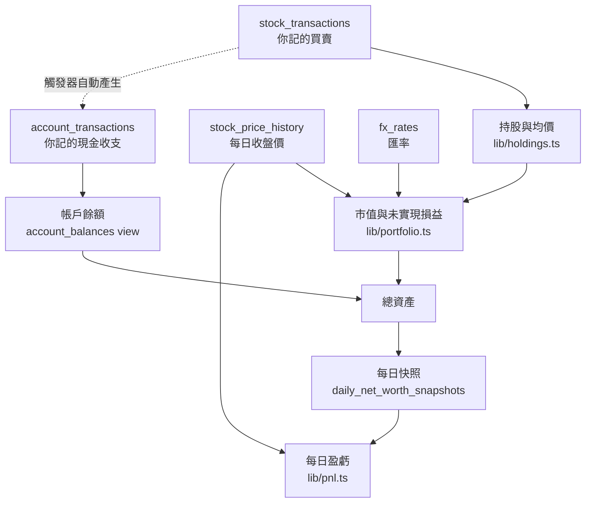

# 每個數字怎麼算出來的

這份把畫面上每一個金額拆開來,對應到公式與程式碼位置。
架構層面的說明在 [技術文件](技術文件.md),操作方式在 [使用手冊](使用手冊.md)。

文件裡的演算用的是真實資料(2026-09-11 收盤),所以你可以拿畫面直接對。

---

## 先分清楚:哪些是存的,哪些是算的

系統裡**只存三種原始事實**,其餘全部是算出來的:

| 存在資料庫的原始事實 | 表 |
|---|---|
| 你記了哪些股票交易 | `stock_transactions` |
| 你記了哪些現金收支 | `account_transactions` |
| 每天的收盤價與匯率 | `stock_price_history`、`fx_rates` |

**沒有任何一個「餘額」或「成本」欄位。** 帳戶沒有餘額欄、持股沒有成本欄。
這是刻意的 —— 有快取欄位就會有「總額跟明細對不起來」的狀態,對記帳系統是致命的。

依賴關係:



---

## 第一層:每一檔的持股與成本

程式在 [`lib/holdings.ts`](../lib/holdings.ts),**網站與同步腳本共用這一份**,是均價的唯一來源。

### 計算前先排序

順序會影響結果,所以排序規則固定:

**交易日 → 同一天 `initial` 排最前 → `created_at` → `id`**

同一天的期初持股一定要排在買賣之前,否則買賣會算在錯誤的基準上。
最後用 `id` 收尾是為了讓結果**可重現** —— 同樣的資料永遠算出同樣的數字。

### 三種交易各自怎麼動

系統從頭累加兩個變數:`shares`(持股數)與 `totalCost`(總成本)。

| 交易 | `shares` | `totalCost` |
|---|---|---|
| **期初持股** `initial` | **設定**為輸入股數 | **設定**為 `股數 × 均價` |
| **買進** `buy` | `+= 買進股數` | `+= 股數 × 價格 ＋ 手續費` |
| **賣出** `sell` | `-= 賣出股數` | `-= 均價 × 賣出股數` |

三件容易搞錯的事:

1. **期初持股是「設定」不是「累加」。** 它代表「我從這天開始有這些」,不是一筆買進。
   資料庫用 partial unique index 保證每人每檔最多一筆。
2. **手續費算進成本,但只有買進。** 賣出的費用不進成本,是從賣出價款裡扣掉,直接影響已實現損益。
3. **賣出不改變均價。** 只是按均價把成本等比移出去。所以賣掉一半,均價不變、總成本減半。

### 均價是算出來的,不是存的

```
均價 = totalCost ÷ shares
```

反過來說 `totalCost` 才是累加的主體,均價是它除以股數的結果。
持股歸零時均價也設為 0(不是 `NaN`)。

### 兩個保護

- **賣超**:賣出股數以實際持股為上限,`Math.min(賣出股數, 持股)`,不會出現負股數。
- **浮點數殘渣**:持股小於 `1e-9` 視為清空,`shares` 與 `totalCost` 一起歸零。
  不這樣做的話,賣光之後會留下 `0.0000000001` 股和一個天文數字的均價。

### 四捨五入

| 欄位 | 小數位 |
|---|---|
| `shares` | 4(零股用) |
| `avgCost` | 4 |
| `totalCost` | 2 |
| `realizedPnL` | 2 |

### 你的實際數字

五檔全部是 2026-05-13 的期初持股,所以 `totalCost = 股數 × 輸入的均價`:

| 標的 | 股數 | 均價 | **總成本** |
|---|---|---|---|
| 00662 富邦NASDAQ | 26,000 | 118.00 | 3,068,000 |
| 00670L 富邦NASDAQ正2 | 15,000 | 198.10 | 2,971,500 |
| 00687B 國泰20年美債 | 77,000 | 31.00 | 2,387,000 |
| 00712 復華富時不動產 | 250,000 | 8.94 | 2,235,000 |
| 2542 興富發 | 23,100 | 42.70 | 986,370 |
| | | **合計** | **11,647,870** |

---

## 第二層:市值與未實現損益

程式在 [`lib/portfolio.ts`](../lib/portfolio.ts) 的 `buildValuedHoldings()`。

```
市值       = 股數 × 收盤價
未實現損益 = 市值 − 總成本
未實現 %   = 未實現損益 ÷ 總成本 × 100
```

**分母是成本,不是市值。** 這樣「賺 10%」的意思才是「相對於你投入的錢賺 10%」。

### 缺報價時的降級

收盤價查不到時**退回成本價**估算(`?? h.avgCost`),不是當成 0。
那一檔的未實現損益會顯示 0,畫面標示「報價未同步」。

理由:總資產不該因為少抓到一天報價就憑空掉一塊。寧可暫時看不出漲跌,
也不要在趨勢圖上留下一道假的斷崖。

### 你的實際數字(2026-09-11 收盤)

| 標的 | 股數 | 收盤價 | 市值 | 總成本 | **未實現損益** | **%** |
|---|---|---|---|---|---|---|
| 00662 | 26,000 | 118.40 | 3,078,400 | 3,068,000 | **+10,400** | +0.34% |
| 00670L | 15,000 | 194.20 | 2,913,000 | 2,971,500 | **−58,500** | −1.97% |
| 00687B | 77,000 | 26.59 | 2,047,430 | 2,387,000 | **−339,570** | −14.23% |
| 00712 | 250,000 | 8.38 | 2,095,000 | 2,235,000 | **−140,000** | −6.26% |
| 2542 | 23,100 | 46.50 | 1,074,150 | 986,370 | **+87,780** | +8.90% |
| | | **合計** | **11,207,980** | **11,647,870** | **−439,890** | **−3.78%** |

舉一檔走完:

```
00687B  77,000 股,均價 31.00,收盤 26.59

總成本     = 77,000 × 31.00      = 2,387,000
市值       = 77,000 × 26.59      = 2,047,430
未實現損益 = 2,047,430 − 2,387,000 = −339,570
未實現 %   = −339,570 ÷ 2,387,000  = −14.23%
```

---

## 已實現損益

只有賣出才會產生,公式在 `calculateHolding()` 的 sell 分支:

```
賣出價款   = 賣出股數 × 成交價 − 手續費與稅
移出的成本 = 賣出當下的均價 × 賣出股數
已實現損益 += 賣出價款 − 移出的成本
```

**是累計的,不會因為賣光再買而歸零。** 賣光之後再買進,均價用新的買進價重新起算,
但已實現損益繼續累加。

你目前沒有任何賣出,所以已實現損益是 **0**。

---

## 幣別換算

**只在兩個地方發生**,其餘所有計算都留在原幣別:

| 位置 | 函式 |
|---|---|
| 網站 | `lib/portfolio.ts` 的 `toTwd()` |
| 同步腳本 | `rebuildSnapshots()` 內 |

```
台幣金額 = 原幣別 = 'USD' ? 金額 × 匯率 : 金額
```

為什麼要留在原幣別到最後一刻:台股與美股的損益直接相加會得出無意義的數字。
必須各自算完再換算成台幣才能加總。

匯率取 `latest_fx_rates`(最新一天)。**抓不到匯率時同步會整份失敗**,
不會用 1:1 硬算 —— 寧可少一天資料,也不要讓美元資產在趨勢圖上失真。

你目前五檔都是台股,所以匯率不參與任何計算。

---

## 帳戶餘額

**帳戶沒有餘額欄位。** 餘額是把流水帳加總出來的。

方向由交易類型決定,存成資料庫的 generated column:

```sql
signed_amount = case type
  when 'withdraw'     then -amount
  when 'transfer_out' then -amount
  else amount   -- initial / deposit / transfer_in / adjustment
end
```

| 類型 | 正負 | 說明 |
|---|---|---|
| 期初餘額 `initial` | ＋ | 起算點,每個帳戶只能有一筆 |
| 存入 `deposit` | ＋ | |
| 提出 `withdraw` | − | |
| 轉入 `transfer_in` | ＋ | 成對記錄,兩邊抵銷 |
| 轉出 `transfer_out` | − | |
| 對帳調整 `adjustment` | **可正可負** | 唯一允許填負數的類型 |

```
帳戶餘額 = SUM(signed_amount)
```

由 `account_balances` view 算出來。所以**要改餘額只能新增一筆流水**,沒有可以直接編輯的總額。

你目前還沒建立任何帳戶,所以現金是 **0**。

---

## 股票交易與券商帳戶的關係

這是你特別問的一段。**兩者透過資料庫觸發器 `sync_broker_cash()` 連動**,
不是應用程式做的 —— 掛在 `stock_transactions` 的 insert / update / delete 上。

### 連動的金額

| 股票交易 | 在券商帳戶產生 | 金額 |
|---|---|---|
| **買進** | 一筆 `withdraw`(提出) | `股數 × 價格 ＋ 手續費` |
| **賣出** | 一筆 `deposit`(存入) | `股數 × 價格 − 手續費與稅`(負數則歸零) |
| **期初持股** | **不連動** | —— |

### 三件要理解的事

**1. 期初持股不連動,因為它不是資金進出。**
它代表你本來就持有的部位,錢在更早以前就付掉了。如果連動,會憑空從券商帳戶扣一大筆。

**2. 連動金額跟「成本」用的是同一個算式,但兩者是不同的東西。**

```
買進 2330  1,000 股 @ 600,手續費 855

成本那邊(holdings.ts):   totalCost += 1,000 × 600 + 855 = 600,855
帳戶那邊(觸發器):        withdraw          1,000 × 600 + 855 = 600,855
```

數字一樣,但意義不同:一個是「這些股票花了我多少」,一個是「券商帳戶少了多少現金」。
賣出時兩者就分開了 —— 成本按**均價**移出,帳戶收到的是**成交價**扣掉費稅。差額就是已實現損益。

**3. UPDATE 時先刪再建。** 改一筆買賣不會留下兩筆連動紀錄;
刪掉買賣時連動紀錄也一併消失。這些列帶有 `stock_transaction_id`,
**永遠不要手動新增或修改**。

### 可以關掉

表單上的「同步更新券商帳戶餘額」預設打開。取消勾選的話,那筆交易只影響持股,
不動任何帳戶餘額 —— `account_id` 存成 `null`,觸發器就跳過。

**你目前五檔都沒有連動**(全部是期初持股,而且你還沒建券商帳戶),
所以這條路徑現在完全沒有作用。

---

## 首頁的四個數字

| 方塊 | 公式 |
|---|---|
| **股票市值** | `SUM(每檔市值換算台幣)` |
| **現金** | `SUM(未封存帳戶的餘額換算台幣)` |
| **未實現損益** | `SUM(每檔未實現損益換算台幣)` |
| **已實現損益** | `SUM(每檔已實現損益換算台幣)` |

主數字:

```
總資產 = 股票市值 + 現金
```

未實現損益方塊底下的百分比,分母是**總成本**:

```
未實現 % = 未實現損益 ÷ (股票市值 − 未實現損益) × 100
```

括號裡那串就是總成本 —— 市值扣掉賺賠回推出投入的錢。

你的實際數字:

```
股票市值   11,207,980
現金                0   (還沒建帳戶)
總資產     11,207,980

未實現損益   −439,890
未實現 %     −439,890 ÷ (11,207,980 + 439,890) = −439,890 ÷ 11,647,870 = −3.78%
已實現損益          0   (沒有賣出)
```

### 期間變化

主數字底下那個漲跌標籤,比的是**趨勢圖上的第一個點與最後一個點**:

```
期間變化 = 最後一天的總資產 − 第一天的總資產
期間 %   = 期間變化 ÷ |第一天的總資產| × 100
```

「1 日」比的是**最近兩個交易日**,不是日曆上的昨天與今天 ——
週一的前一天是週日,沒有開盤,比出來會是 0。

---

## 每日快照

程式在 [`lib/snapshots.ts`](../lib/snapshots.ts) 的 `computeSnapshotRows()`,
**每日同步與歷史回填共用這一份**。

它對某一天做的事:

1. 把**當天(含)以前**的現金流水加總 → 各帳戶餘額 → 依持有人加總換算台幣
2. 把**當天(含)以前**的股票交易餵給 `calculateHoldings()` → 各檔持股
3. 用**那一天的收盤價**估市值(查不到就退回成本價)
4. 每位成員寫一列,每個家庭再寫一列 `owner_id IS NULL` 的合計

「全家」視角讀的就是那列合計。

**每次同步重算今天與昨天**,因為證交所常常比 14:30 的排程晚公布收盤價。
更早的日子不會自己修正,補登舊交易之後要跑 `npm run backfill`。

---

## 每日盈虧(日曆)

程式在 [`lib/pnl.ts`](../lib/pnl.ts)。

```
當日盈虧 = 股票市值變化 − 當日買進金額 + 當日賣出金額 − 當日手續費與稅
```

寫成程式裡的形式:

```
當日盈虧 = 今日股票市值 − 昨日股票市值 − 部位變動

其中  部位變動 = Σ買進(股數 × 價格 ＋ 手續費) − Σ賣出(股數 × 價格 − 手續費與稅)
```

### 三個關鍵設計

**1. 基準是股票市值,不是總資產。**
用總資產的話,沒勾選連動帳戶的買賣會憑空生出資產 —— 股票增加了、現金卻沒減少。
改看股票市值之後現金完全不參與,有沒有連動都算得對。

**2. 買進 50 萬不是賺 50 萬。** 那只是現金換成股票,要從市值變化裡扣掉。
扣完之後剩下的才是市場給你的漲跌,而手續費與稅是真的成本。

**3. 導入既有持股那天不計盈虧。** 那天你既沒賺也沒賠,只是把本來就有的輸入進來。
不擋的話 2026-05-13 會顯示成暴賺 1,150 萬(那天的市值)。

### 現金不參與

銀行利息不會顯示成盈虧,對帳調整也不會。日曆回答的是「投資賺賠多少」,
不是「資產增減多少」。

### 三種空白格

| 顯示 | 意思 | 判斷依據 |
|---|---|---|
| **休市** | 國定假日 | 有快照,日期在已知報價範圍內卻沒有收盤價 |
| **待更新** | 收盤價還沒抓到 | 有快照,日期超過最後一個有報價的日子 |
| 完全留白 | 未來,或持有起始日之前 | 沒有快照 |

### 點開的單日明細

每一檔各自算,加總**精確等於**日曆格子的數字:

```
某檔當日盈虧 = 當日市值 − 前日市值 − 這檔當天的部位變動
某檔漲跌幅   = 當日盈虧 ÷ 前日市值 × 100
```

兩邊共用同一套規則(同樣的持股計算、同樣的缺價退回成本價、同樣的交易扣除),
所以加總一定對得起來。`tests/pnl.test.ts` 有一個案例專門釘住這件事。

---

## 對照表:哪個數字來自哪裡

| 畫面上的數字 | 來源 |
|---|---|
| 持股的股數、均價、總成本 | `lib/holdings.ts` |
| 持股的市值、未實現損益 | `lib/portfolio.ts` `buildValuedHoldings()` |
| 已實現損益 | `lib/holdings.ts` sell 分支 |
| 首頁四個統計方塊 | `lib/portfolio.ts` `computeTotals()` |
| 圓餅圖的每一片 | `lib/portfolio.ts` `buildAssetSlices()` |
| 趨勢圖的每一點 | `daily_net_worth_snapshots` 資料表 |
| 帳戶餘額、流水帳結餘 | `account_balances` view(資料庫) |
| 券商帳戶的自動進出 | `sync_broker_cash()` 觸發器(資料庫) |
| 日曆每一格 | `lib/pnl.ts` `computeDailyPnl()` |
| 日曆點開的每檔明細 | `lib/pnl.ts` `computeHoldingPnl()` |
