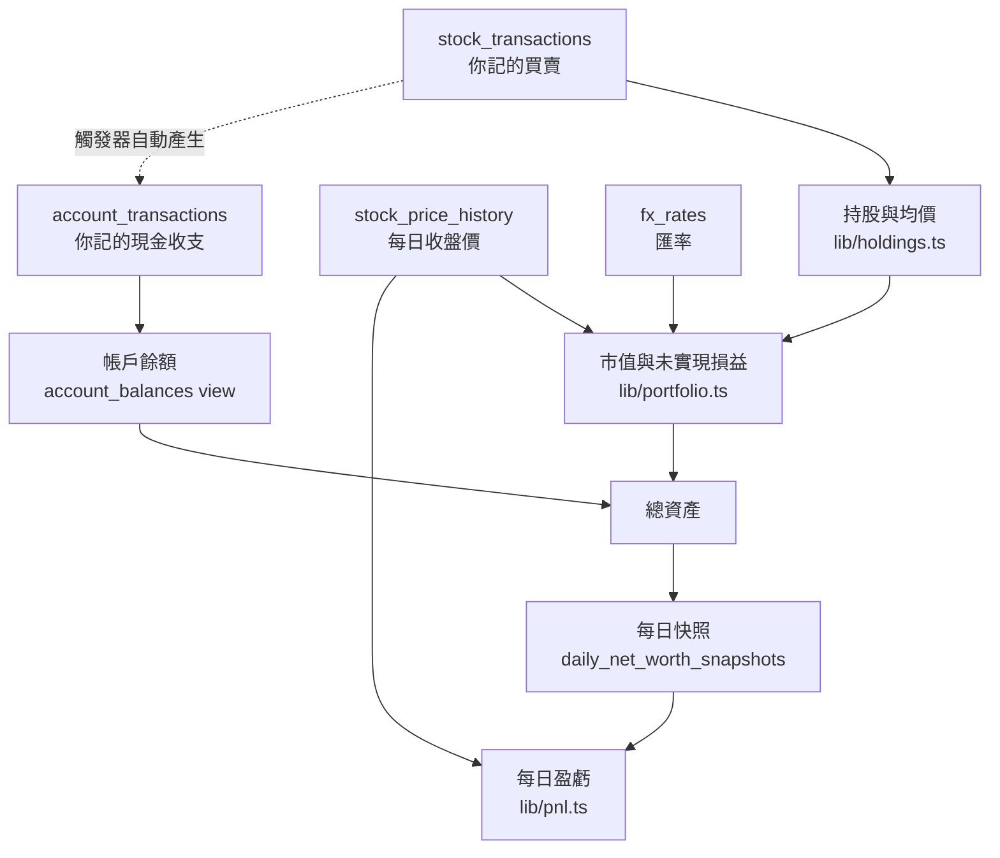

# 每個數字怎麼算出來的

這份把畫面上每一個金額拆開來,對應到公式與程式碼位置。
架構層面的說明在 [技術文件](技術文件.md),操作方式在 [使用手冊](使用手冊.md)。

文件裡的演算用的是真實資料:「第二層」的持股表取自 2026-09-11 收盤;已實現損益、首頁數字與年度損益
取自 2026-09-24 收盤(當天實際買進 00662、賣出 00687B 之後)。價格之後會變,公式不會。

---

## 先分清楚:哪些是存的,哪些是算的

系統裡**只存三種原始事實**,其餘全部是算出來的:

| 存在資料庫的原始事實 | 表 |
|---|---|
| 你記了哪些股票交易 | `stock_transactions` |
| 你記了哪些現金收支 | `account_transactions` |
| 每天的收盤價與匯率 | `stock_price_history`、`fx_rates` |

**沒有任何一個「餘額」或「成本」欄位。** 帳戶沒有餘額欄、持股沒有成本欄。
這是刻意的 —— 有快取欄位就會有「總額跟明細對不起來」的狀態,對記帳系統是致命的。

依賴關係:


```mermaid
flowchart TD
  T["stock_transactions<br/>你記的買賣"] --> H["持股與均價<br/>lib/holdings.ts"]
  P["stock_price_history<br/>每日收盤價"] --> V["市值與未實現損益<br/>lib/portfolio.ts"]
  H --> V
  F["fx_rates<br/>匯率"] --> V

  A["account_transactions<br/>你記的現金收支"] --> B["帳戶餘額<br/>account_balances view"]
  T -.->|"觸發器自動產生"| A

  V --> N["總資產"]
  B --> N
  N --> S["每日快照<br/>daily_net_worth_snapshots"]
  S --> D["每日盈虧<br/>lib/pnl.ts"]
  P --> D
```

---

## 第一層:每一檔的持股與成本

程式在 [`lib/holdings.ts`](../lib/holdings.ts),**網站與同步腳本共用這一份**,是均價的唯一來源。

### 計算前先排序

順序會影響結果,所以排序規則固定:

**交易日 → 同一天 `initial` 排最前 → `created_at` → `id`**

同一天的期初持股一定要排在買賣之前,否則買賣會算在錯誤的基準上。
最後用 `id` 收尾是為了讓結果**可重現** —— 同樣的資料永遠算出同樣的數字。

### 五種交易各自怎麼動

系統從頭累加三個變數:`shares`(持股數)、`totalCost`(總成本)與 `dividendIncome`(股利收入)。

| 交易 | `shares` | `totalCost` | `dividendIncome` |
|---|---|---|---|
| **期初持股** `initial` | **設定**為輸入股數 | **設定**為 `股數 × 均價` | — |
| **買進** `buy` | `+= 買進股數` | `+= 股數 × 價格 ＋ 手續費` | — |
| **賣出** `sell` | `-= 賣出股數` | `-= 均價 × 賣出股數` | — |
| **現金股利** `dividend` | 不變 | 不變 | `+= 股數 × 每股配息 − 扣款` |
| **配股** `stock_dividend` | `+= 配到的股數` | **不變**(所以均價下降) | — |

三件容易搞錯的事:

1. **期初持股是「設定」不是「累加」。** 它代表「我從這天開始有這些」,不是一筆買進。
   資料庫用 partial unique index 保證每人每檔最多一筆。
2. **手續費算進成本,但只有買進。** 賣出的費用不進成本,是從賣出價款裡扣掉,直接影響已實現損益。
3. **賣出不改變均價。** 只是按均價把成本等比移出去。所以賣掉一半,均價不變、總成本減半。

### 均價是算出來的,不是存的

```
均價 = totalCost ÷ shares
```

反過來說 `totalCost` 才是累加的主體,均價是它除以股數的結果。
持股歸零時均價也設為 0(不是 `NaN`)。

### 兩個保護

- **賣超**:賣出股數以實際持股為上限,`Math.min(賣出股數, 持股)`,不會出現負股數。
- **浮點數殘渣**:持股小於 `1e-9` 視為清空,`shares` 與 `totalCost` 一起歸零。
  不這樣做的話,賣光之後會留下 `0.0000000001` 股和一個天文數字的均價。

### 四捨五入

| 欄位 | 小數位 |
|---|---|
| `shares` | 4(零股用) |
| `avgCost` | 4 |
| `totalCost` | 2 |
| `realizedPnL` | 2 |

### 你的實際數字

五檔全部是 2026-05-13 的期初持股,所以 `totalCost = 股數 × 輸入的均價`:

| 標的 | 股數 | 均價 | **總成本** |
|---|---|---|---|
| 00662 富邦NASDAQ | 26,000 | 118.00 | 3,068,000 |
| 00670L 富邦NASDAQ正2 | 15,000 | 198.10 | 2,971,500 |
| 00687B 國泰20年美債 | 77,000 | 31.00 | 2,387,000 |
| 00712 復華富時不動產 | 250,000 | 8.94 | 2,235,000 |
| 2542 興富發 | 23,100 | 42.70 | 986,370 |
| | | **合計** | **11,647,870** |

---

## 第二層:市值與未實現損益

程式在 [`lib/portfolio.ts`](../lib/portfolio.ts) 的 `buildValuedHoldings()`。

```
市值       = 股數 × 收盤價
未實現損益 = 市值 − 總成本
未實現 %   = 未實現損益 ÷ 總成本 × 100
```

**分母是成本,不是市值。** 這樣「賺 10%」的意思才是「相對於你投入的錢賺 10%」。

### 缺報價時的降級

收盤價查不到時**退回成本價**估算(`?? h.avgCost`),不是當成 0。
那一檔的未實現損益會顯示 0,畫面標示「報價未同步」。

理由:總資產不該因為少抓到一天報價就憑空掉一塊。寧可暫時看不出漲跌,
也不要在趨勢圖上留下一道假的斷崖。

### 你的實際數字(2026-09-11 收盤)

| 標的 | 股數 | 收盤價 | 市值 | 總成本 | **未實現損益** | **%** |
|---|---|---|---|---|---|---|
| 00662 | 26,000 | 118.40 | 3,078,400 | 3,068,000 | **+10,400** | +0.34% |
| 00670L | 15,000 | 194.20 | 2,913,000 | 2,971,500 | **−58,500** | −1.97% |
| 00687B | 77,000 | 26.59 | 2,047,430 | 2,387,000 | **−339,570** | −14.23% |
| 00712 | 250,000 | 8.38 | 2,095,000 | 2,235,000 | **−140,000** | −6.26% |
| 2542 | 23,100 | 46.50 | 1,074,150 | 986,370 | **+87,780** | +8.90% |
| | | **合計** | **11,207,980** | **11,647,870** | **−439,890** | **−3.78%** |

舉一檔走完:

```
00687B  77,000 股,均價 31.00,收盤 26.59

總成本     = 77,000 × 31.00      = 2,387,000
市值       = 77,000 × 26.59      = 2,047,430
未實現損益 = 2,047,430 − 2,387,000 = −339,570
未實現 %   = −339,570 ÷ 2,387,000  = −14.23%
```

---

## 已實現損益

**已實現 = 買賣的已實現 + 股利實收**。兩者都是已經落袋、不會再變的錢。
畫面上會拆開寫,例如首頁小字「買賣 −364,785 ＋ 股利 +241,904」,兩個數字加起來等於大字。

買賣的部分只有賣出才會產生,公式在 `calculateHolding()` 的 sell 分支:

```
賣出價款   = 賣出股數 × 成交價 − 手續費與稅
移出的成本 = 賣出當下的均價 × 賣出股數
已實現損益 += 賣出價款 − 移出的成本
```

**是累計的,不會因為賣光再買而歸零。** 賣光之後再買進,均價用新的買進價重新起算,
但已實現損益繼續累加。

你目前唯一的賣出是 9/24 全部賣掉 00687B:

```
賣出價款   77,000 × 26.30 − 2,885 = 2,022,215
移出的成本 31.00 × 77,000        = 2,387,000
已實現損益                        =  −364,785
```

**合計要從全部交易重算,不能從持股清單加總。** 持股清單會濾掉股數 0 的標的,
而全部賣光的那一檔正是已實現損益的來源 —— 從清單加的話,00687B 那筆會整筆消失,
首頁曾經因為這樣顯示成 0(已修正,見 `lib/portfolio.ts` 的 `computeRealizedTwd()`)。

---

## 幣別換算

**只在兩個地方發生**,其餘所有計算都留在原幣別:

| 位置 | 函式 |
|---|---|
| 網站 | `lib/portfolio.ts` 的 `toTwd()` |
| 同步腳本 | `rebuildSnapshots()` 內 |

```
台幣金額 = 原幣別 = 'USD' ? 金額 × 匯率 : 金額
```

為什麼要留在原幣別到最後一刻:台股與美股的損益直接相加會得出無意義的數字。
必須各自算完再換算成台幣才能加總。

匯率取 `latest_fx_rates`(最新一天)。**抓不到匯率時同步會整份失敗**,
不會用 1:1 硬算 —— 寧可少一天資料,也不要讓美元資產在趨勢圖上失真。

你目前五檔都是台股,所以匯率不參與任何計算。

---

## 帳戶餘額

**帳戶沒有餘額欄位。** 餘額是把流水帳加總出來的。

方向由交易類型決定,存成資料庫的 generated column:

```sql
signed_amount = case type
  when 'withdraw'     then -amount
  when 'transfer_out' then -amount
  else amount   -- initial / deposit / transfer_in / adjustment
end
```

| 類型 | 正負 | 說明 |
|---|---|---|
| 期初餘額 `initial` | ＋ | 起算點,每個帳戶只能有一筆 |
| 存入 `deposit` | ＋ | |
| 提出 `withdraw` | − | |
| 轉入 `transfer_in` | ＋ | 成對記錄,兩邊抵銷 |
| 轉出 `transfer_out` | − | |
| 對帳調整 `adjustment` | **可正可負** | 唯一允許填負數的類型 |

```
帳戶餘額 = SUM(signed_amount)
```

由 `account_balances` view 算出來。所以**要改餘額只能新增一筆流水**,沒有可以直接編輯的總額。

你目前還沒建立任何帳戶,所以現金是 **0**。

---

## 股票交易與券商帳戶的關係

這是你特別問的一段。**兩者透過資料庫觸發器 `sync_broker_cash()` 連動**,
不是應用程式做的 —— 掛在 `stock_transactions` 的 insert / update / delete 上。

### 連動的金額

| 股票交易 | 在券商帳戶產生 | 金額 |
|---|---|---|
| **買進** | 一筆 `withdraw`(提出) | `股數 × 價格 ＋ 手續費` |
| **賣出** | 一筆 `deposit`(存入) | `股數 × 價格 − 手續費與稅`(負數則歸零) |
| **現金股利** | 一筆 `deposit`(存入),日期是**發放日**(沒填就用除息日) | `股數 × 每股配息 − 二代健保等` |
| **期初持股、配股** | **不連動** | —— |

### 三件要理解的事

**1. 期初持股不連動,因為它不是資金進出。**
它代表你本來就持有的部位,錢在更早以前就付掉了。如果連動,會憑空從券商帳戶扣一大筆。

**2. 連動金額跟「成本」用的是同一個算式,但兩者是不同的東西。**

```
買進 2330  1,000 股 @ 600,手續費 855

成本那邊(holdings.ts):   totalCost += 1,000 × 600 + 855 = 600,855
帳戶那邊(觸發器):        withdraw          1,000 × 600 + 855 = 600,855
```

數字一樣,但意義不同:一個是「這些股票花了我多少」,一個是「券商帳戶少了多少現金」。
賣出時兩者就分開了 —— 成本按**均價**移出,帳戶收到的是**成交價**扣掉費稅。差額就是已實現損益。

**3. UPDATE 時先刪再建。** 改一筆買賣不會留下兩筆連動紀錄;
刪掉買賣時連動紀錄也一併消失。這些列帶有 `stock_transaction_id`,
**永遠不要手動新增或修改**。

### 可以關掉

表單上的「同步更新券商帳戶餘額」預設打開。取消勾選的話,那筆交易只影響持股,
不動任何帳戶餘額 —— `account_id` 存成 `null`,觸發器就跳過。

**你目前所有交易都沒有連動**:五檔期初持股本來就不連動,9/24 那兩筆買賣則因為你還沒建券商帳戶,
所以沒有勾選連動。這條路徑要等你建了券商帳戶、記第一筆有勾連動的買賣才會開始作用。

### 編輯交易時

改一筆買賣,觸發器會刪掉舊的連動紀錄、依新內容重建一筆,券商帳戶餘額立刻跟著變。
所以要改連動金額,一律回股票頁改原本那筆買賣,不要去帳戶頁改。

---

## 首頁的四個數字

| 方塊 | 公式 | 你的數字(9/24) |
|---|---|---:|
| **股票市值** | `SUM(每檔市值換算台幣)` | 11,250,950 |
| **現金** | `SUM(未封存帳戶的餘額換算台幣)` | 0(還沒建帳戶) |
| **今年未實現損益** | 年度損益表今年那列的未實現(當年變動) | −3,156 |
| **今年已實現損益** | 今年賣出的已實現 ＋ 今年股利實收 | 見下面「配息與配股」 |

主數字:

```
總資產 = 股票市值 + 現金 = 11,250,950
```

「今年未實現」底下的小字是**目前持股的帳面未實現**與它的百分比,分母是總成本:

```
帳面未實現   = 股票市值 − 目前持股總成本 = 11,250,950 − 11,254,106 = −3,156
帳面未實現 % = 帳面未實現 ÷ (股票市值 − 帳面未實現) × 100
```

括號裡那串就是總成本 —— 市值扣掉賺賠回推出投入的錢。
今年的兩個數字跟帳面剛好一樣,因為 2026 年初還沒有任何持股;從 2027 年開始就會不同。
兩格的算法詳見下面「年度損益」一節。

### 期間變化

主數字底下那個漲跌標籤,比的是**趨勢圖上的第一個點與最後一個點**:

```
期間變化 = 最後一天的總資產 − 第一天的總資產
期間 %   = 期間變化 ÷ |第一天的總資產| × 100
```

「1 日」比的是**最近兩個交易日**,不是日曆上的昨天與今天 ——
週一的前一天是週日,沒有開盤,比出來會是 0。

---

## 每日快照

程式在 [`lib/snapshots.ts`](../lib/snapshots.ts) 的 `computeSnapshotRows()`,
**每日同步與歷史回填共用這一份**。

它對某一天做的事:

1. 把**當天(含)以前**的現金流水加總 → 各帳戶餘額 → 依持有人加總換算台幣
2. 把**當天(含)以前**的股票交易餵給 `calculateHoldings()` → 各檔持股
3. 用**那一天的收盤價**估市值(查不到就退回成本價)
4. 每位成員寫一列,每個家庭再寫一列 `owner_id IS NULL` 的合計

「全家」視角讀的就是那列合計。

**每次同步至少重算今天與昨天**,並向交易所重抓近幾個交易日的**正式收盤價**。
交易所還沒公布時會先用 Yahoo 暫時補上,下一班就會換成正式價格,那幾天的快照也跟著重算 ——
所以日曆上已經顯示數字的日子,用的都是正式收盤價。還有任何一檔持股缺當天收盤價的日子,
日曆會顯示「待更新」,不會給一個用舊價格算出來、看起來正常的數字。

**交易有變動時從最早受影響的那天重算。** 補登、編輯或刪除一筆過去的交易,資料庫觸發器會記下
新舊日期中較早的那天,下一次每日同步就從那天重算到今天,不用再手動回填。

仍然要手動回填的只有一種情況:新增一檔**以前沒有的股票**、而且交易日期在過去。
每日同步只抓最新收盤價,那段期間的歷史價格要靠回填去補抓,否則會用成本價估算。

---

## 每日盈虧(日曆)

程式在 [`lib/pnl.ts`](../lib/pnl.ts)。

```
當日盈虧 = 股票市值變化 − 當日買進金額 + 當日賣出金額 − 當日手續費與稅
```

寫成程式裡的形式:

```
當日盈虧 = 今日股票市值 − 昨日股票市值 − 部位變動

其中  部位變動 = Σ買進(股數 × 價格 ＋ 手續費) − Σ賣出(股數 × 價格 − 手續費與稅)
                − Σ現金股利實收
```

**除息日**:股價下跌的那一段被股利抵銷,那天不會顯示成虧損,剩下的只有二代健保這種真正的成本。
**除權日**:配到的股數本身就在市值裡,剛好抵銷除權的價差,不需要另外調整。

### 三個關鍵設計

**1. 基準是股票市值,不是總資產。**
用總資產的話,沒勾選連動帳戶的買賣會憑空生出資產 —— 股票增加了、現金卻沒減少。
改看股票市值之後現金完全不參與,有沒有連動都算得對。

**2. 買進 50 萬不是賺 50 萬。** 那只是現金換成股票,要從市值變化裡扣掉。
扣完之後剩下的才是市場給你的漲跌,而手續費與稅是真的成本。

**3. 導入既有持股那天不計盈虧。** 那天你既沒賺也沒賠,只是把本來就有的輸入進來。
不擋的話 2026-05-13 會顯示成暴賺 1,150 萬(那天的市值)。

### 現金不參與

銀行利息不會顯示成盈虧,對帳調整也不會。日曆回答的是「投資賺賠多少」,
不是「資產增減多少」。

### 月合計與 12 個月列

```
月合計 = 當月每一格的加總
月 %   = 月合計 ÷ 當月第一個有盈虧那天的前一日股票市值 × 100
```

分母通常是上個月底的市值;持有起始那個月則是導入那天。日曆上方的 12 個月列每一格就是這個月合計,
點一格會跳到那個月。漲跌天數以四捨五入到元為準,剛好 0 的日子兩邊都不算。

**全年加總不等於總覽「年度損益」的合計。** 差距剛好是導入那天「市值 − 成本」:
2026 年日曆加總 −221,821,年度表 −367,941,差 146,120 = 5/13 導入時的市值 11,501,750 比成本 11,647,870 少的部分。
日曆刻意不算導入那天,年度表則是跟你輸入的成本比。

### 三種空白格

| 顯示 | 意思 | 判斷依據 |
|---|---|---|
| **節日名稱** | 國定假日 | 證交所年度行事曆(`market_holidays`),未來的假日也標得出來 |
| **休市** | 行事曆沒列到的休市 | 有快照,日期在已知報價範圍內卻沒有收盤價 |
| **待更新** | 收盤價還沒到齊 | 有快照,但日期超過最後一個有報價的日子,或持有中的台股有任何一檔還沒有當天收盤價 |
| 完全留白 | 未來,或持有起始日之前 | 沒有快照 |

### 點開的單日明細

每一檔各自算,加總**精確等於**日曆格子的數字:

```
某檔當日盈虧 = 當日市值 − 前日市值 − 這檔當天的部位變動
某檔漲跌幅   = 當日盈虧 ÷ 前日市值 × 100
```

兩邊共用同一套規則(同樣的持股計算、同樣的缺價退回成本價、同樣的交易扣除),
所以加總一定對得起來。`tests/pnl.test.ts` 有一個案例專門釘住這件事。

---

## 走一遍:買進一檔已經持有的股票

前面各節是分開的公式,這一節把它們串成一筆交易的完整路徑。
用 00662 當例子 —— 買進前是 26,000 股、均價 118.00、成本 3,068,000。

假設 **9/15 買進 5,000 股 @ 120.00,手續費 855**。

### 你輸入什麼

市場、代號、類型、股數、價格、手續費、交易日期,以及要不要勾「連動券商帳戶」。

**台股的手續費會自動帶出**,可以手動改(`lib/fees.ts`):

```
手續費 = 成交金額 × 0.1425%,無條件捨去,最低 20 元
證交稅 = 只有賣出才有,無條件捨去
         一般股票 0.3%、ETF(00 開頭)0.1%、債券 ETF(00 開頭 B 結尾)停徵至 2026-12-31
```

照的是牌告費率,**沒有算券商折扣**。有折扣的話直接改掉,改過之後就不會再被自動覆蓋。
存進資料庫的是欄位上最後的數字,系統之後的所有計算只認這個數字。
美股各券商收費差很多,不自動帶。

### 成本與均價

```
買進前   26,000 股   均價 118.0000   成本 3,068,000
買進後   31,000 股   均價 118.3502   成本 3,668,855

3,068,000 + 5,000 × 120 + 855 = 3,668,855
3,668,855 ÷ 31,000            = 118.3502
```

**手續費整筆折進成本**,所以均價 118.3502 會略高於「118 與 120 的加權平均」118.3226,
差的就是那 855 元攤到 31,000 股上。

原本那筆 `initial` 不會被動到 —— 買進是**新增一筆交易**,程式每次都從第一筆重算。

### 券商帳戶

看有沒有勾「連動」:

- **勾了** → 觸發器在指定帳戶插一筆 `withdraw 600,855`(`round(股數×價格,2) + 手續費`),餘額少 600,855。
- **沒勾** → 帳戶完全不動,但股票成本照樣加 600,855。

沒勾的話總資產會**憑空多出 60 萬**(股票變多、現金沒少)。
這正是每日盈虧只看股票市值、完全不碰現金的原因(見上面「現金不參與」)。

### 未實現損益

假設之後收在 121:

```
市值     31,000 × 121 = 3,751,000
未實現   3,751,000 − 3,668,855 = +82,145
%        82,145 ÷ 3,668,855    = +2.24%     ← 分母是成本
```

### 買進當天的日曆

那一格會出現**買進標記**,盈虧照公式算。
假設 00662 昨收 118.40、當日收 120.50,其他四檔不變:

```
部位變動 = 5,000 × 120 + 855 = 600,855

+56,245 = 舊 26,000 股(118.40→120.50)  +54,600
        + 新  5,000 股(120.00→120.50)  + 2,500
        − 手續費                            855
```

部位變動被扣掉,所以**買進本身不會被算成賺 60 萬**,那一格只反映價格變動與付掉的手續費。

點進去看單檔明細時,00662 那一列的百分比分母是**前一日市值 3,078,400**
(當天才買的股數不在分母裡),所以會比整體的百分比大一些。

### 後來賣掉一部分

再假設 10/1 賣出 8,000 股 @ 125,費稅合計 1,000:

```
剩餘 23,000 股   均價 118.3502(不變)   成本 2,722,053.71   已實現 +52,198.71

成本移出   118.3502 × 8,000    =   946,801.29   ← 成本端走這個
實收價款   8,000 × 125 − 1,000 =   999,000      ← 帳戶端收這個
已實現     999,000 − 946,801.29 = +52,198.71    ← 兩者的差
```

這是成本與帳戶**唯一會分岔的地方**:買進時兩邊金額一樣,賣出時一個走均價、
一個走成交價,差額就是已實現損益。賣出的費稅不進成本,是從價款裡扣掉的。

### 一個要留意的地方

補登一筆**日期在過去**的交易之後,持股、均價、損益會立刻變,但趨勢圖與日曆的快照
要等**下一次每日同步**(平日 14:47 與 06:17,GitHub 常會延後幾小時)才會從那天重算。這段期間日曆那一格可能跟點開的明細對不起來,
同步跑過就好。如果是以前沒買過的股票,還要跑一次回填補歷史價格(見上面「每日快照」)。

---

## 年度損益(總覽下方的年度表、上方的「今年」兩格)

程式在 [`lib/yearly.ts`](../lib/yearly.ts)。每一年當成一段期間結算,**只看股票,不含現金**:

```
當年總損益 = 期末股票市值 − 期初股票市值 − 當年買入 + 當年賣出實收 + 當年股利實收
當年已實現 = 當年每筆賣出的(實收價款 − 按均價移出的成本) + 當年股利實收
當年未實現 = 當年總損益 − 當年已實現
```

股利同時加進總損益與已實現,所以**不影響未實現**。配股的買入金額是 0,不算買入。

- **期初**是前一年 12/31 收盤,**期末**是當年 12/31 收盤;今年的期末是最新收盤。
- **買入**含手續費,也包含導入的期初持股(以輸入的成本計)。不算的話,導入那年會憑空多出整包持股的市值。
- **賣出實收**已扣手續費與稅。
- 用股票市值而不是總資產:薪水入帳、沒勾連動的買賣都會讓總資產變動,但那不是投資賺賠。

**未實現是「當年的變動」,不是年底的帳面數字。** 所以各年可以直接相加,「全部」那列就是各年加總,
而且剛好等於「目前持股帳面未實現 + 累計已實現」。

代價是賣出那一年,之前累積的帳面獲利會從未實現搬到已實現:

```
2026 年 100 買進,年底 120;2027 年 130 賣出

2026   未實現 +20   已實現   0   合計 +20
2027   未實現 −20   已實現 +30   合計 +10   ← −20 不是虧損,是之前的 +20 兌現了
```

已實現用的是原始成本,跟券商對帳單、報稅的數字一致。

年度合計**不會剛好等於**盈虧日曆的全年加總:日曆在導入既有持股那天不計盈虧,
年度表則是跟你輸入的成本比,導入時帳上已經有的漲跌會算進導入那一年的未實現。

---

## 配息與配股

程式在 [`lib/holdings.ts`](../lib/holdings.ts)(持股與股利收入)與 [`lib/dividends.ts`](../lib/dividends.ts)(待確認配息)。

### 兩種交易

| | 現金股利 | 配股 |
|---|---|---|
| 股數欄 | 除息日**前一天收盤時**的持股 | 配到幾股 |
| 價格欄 | 每股配息 | —(存成 0) |
| 費用欄 | 二代健保、匯費;美股是預扣稅 | — |
| 日期 | **除息日**(盈虧算在這天);另可填**發放日** | 除權日 |
| 持股與成本 | 都不變 | 股數增加、總成本不變 |
| 券商帳戶 | 有勾連動的話,在發放日存入實收 | 不連動 |

### 設計上的兩個決定

**股利算進已實現,不另外成一項。** 已實現代表「已經落袋、不會再變的錢」,股利跟賣股票一樣。
年度表維持 4 欄,「總損益 = 未實現 + 已實現」也不用改。要看買賣與股利各多少,首頁小字與年度表展開都拆開列。

**股利不拿來扣成本。** 均價要跟券商對帳單一致;而且長期持有下去,累積的股利會超過成本,均價變成負數。
兩種算法的**總損益完全一樣**,差別只在錢放在未實現還是已實現:

```
00712 今年兩次配息實收 106,455,9/24 收盤 7.82

                不扣成本(採用)     扣成本
均價            8.94               8.51
未實現          −280,000           −173,545
已實現(股利)  +106,455           0
這檔總損益      −173,545           −173,545
```

### 配股:均價怎麼變

```
2542 持有 23,100 股、均價 42.70、總成本 986,370,每千股配 50 股

配到      23,100 × 0.05 = 1,155 股
總成本    986,370(不變)
均價      986,370 ÷ 24,255 = 40.6667
```

交易所公告的配股率像 `0.04999999`,要先四捨五入到小數 6 位再乘,否則會算成 1,154 股。
不足一股的部分捨去(實務上會折算現金發放)。

### 二代健保的估算

單次給付 **2 萬元以上**扣 **2.11%**,元以下四捨五入;美股預扣 30%。這只是表單預設值:
ETF 的配息有一部分(收益平準金)不扣,系統不知道比例,所以通常會估得比實際多一點,請以入帳金額為準。

### 待確認配息(自動提示)

每日同步抓證交所與櫃買的**除權除息預告表**,寫進 `corporate_actions`。股票頁上方會列出:

- 除息日已經到了(今天或以前)
- 你在除息日**前一天收盤時**有持股 —— 除息日當天才買的領不到,當天賣掉的照樣領得到
- 還沒記錄、也沒按過「略過」
- 金額已經公布(ETF 常在除息前幾天才公布)

按「記錄」會打開已經填好的表單,核對後存檔。預告表只涵蓋前後一個多月,所以功能上線(2026-10)
以前的配息要手動補;上線後每天寫入,歷史會越來越完整。

### 股利所得(報稅核對用)

年度表展開後的最下面列出當年的現金股利總額、配股以面額 10 元計的股利所得、二代健保與預扣稅。
ETF 的配息含股利、利息與收益平準金,各自課稅方式不同 —— 這些數字是用來**核對**國稅局列的有沒有漏,
報稅以國稅局的所得資料為準。

---

## 對照表:哪個數字來自哪裡

| 畫面上的數字 | 來源 |
|---|---|
| 持股的股數、均價、總成本 | `lib/holdings.ts` |
| 持股的市值、未實現損益 | `lib/portfolio.ts` `buildValuedHoldings()` |
| 已實現損益 | `lib/holdings.ts` sell 分支 |
| 首頁股票市值、現金 | `lib/portfolio.ts` `computeTotals()` |
| 已實現損益合計 | `lib/portfolio.ts` `computeRealizedTwd()` |
| 圓餅圖的每一片 | `lib/portfolio.ts` `buildAssetSlices()` |
| 趨勢圖的每一點 | `daily_net_worth_snapshots` 資料表 |
| 帳戶餘額、流水帳結餘 | `account_balances` view(資料庫) |
| 券商帳戶的自動進出 | `sync_broker_cash()` 觸發器(資料庫) |
| 日曆每一格 | `lib/pnl.ts` `computeDailyPnl()` |
| 日曆點開的每檔明細 | `lib/pnl.ts` `computeHoldingPnl()` |
| 今年未實現 / 已實現、年度損益表 | `lib/yearly.ts` `computeYearly()` |
| 累計股利、股利收入 | `lib/holdings.ts` 的 `dividendIncome` |
| 待確認配息 | `lib/dividends.ts` `dividendSuggestions()` |
